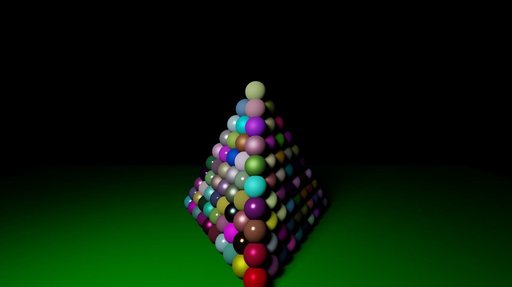
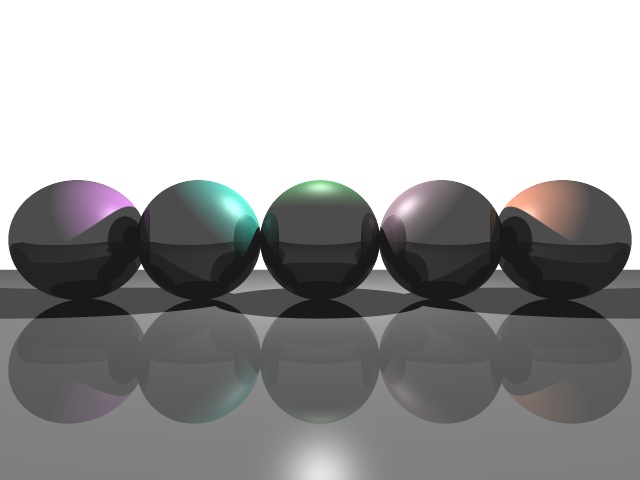

# Raytracing

## Description

The project is to build a ray tracer which handle opaque surfaces with lighting and shadows.

## Features

 - Recursive ray tracing triangles/sphere 

 - Phong shading

 - Antialiasing by by average the value of subpixels

 - Soft shadow by generate sublights

 - Multithread MonteCarlo sampling

 - BVH tree for speed up calculation

## Results

Snow man

Sphere pyramid

Spheres with recursive ray tracing

250 times MonteCarlo sampling

10000 times MonteCarlo sampling

